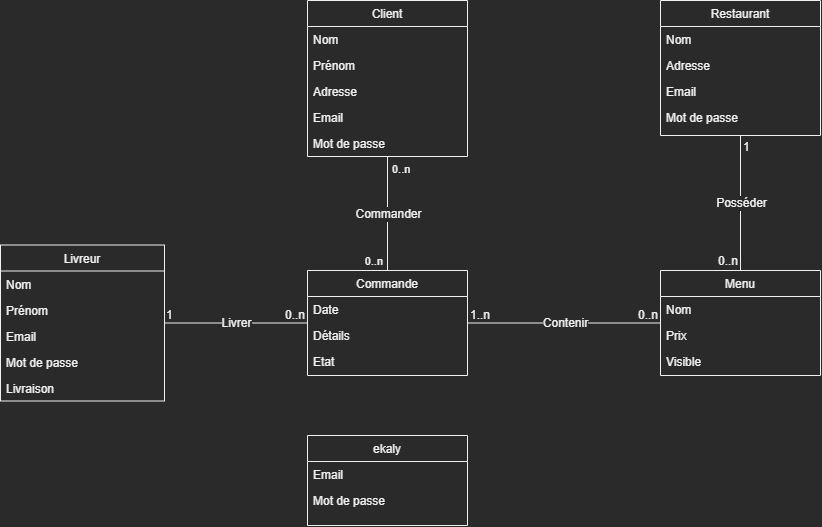

# MEAN Stack E-Kaly - Server

Backed pour l'application E-Kaly.

Selon les consignes reçu dans le document `Projet-Mean-M1-P9.pdf`, le serveur devra être basé sur express et la base de donnée sur mongodb (plus précisément, Mongo Atlas).

## Modélisation des données

Malgré la permissivité de MongoDB concernant les schémas de donnée, une meilleure organisation nous offrira un projet mieux préparé à la montée en charge et à la maintenance.

Après analyse du cahier des charges, nous avons trouvé 2 types de données: les utilisateurs et les données métiers.

Cependant, nous avons plusieurs types d'utilisateurs basé sur leurs rôles. Après reflexion, nous avons décidé de les séparer au plutôt que de les enregistrer au même endroit et distinguer avec un attribut rôle. Ce choix nous permettra une séparation plus facile des logiques de notre code et aussi mieux supporter les changements d'architecture en séparant les services (malgré une architecture monolithique).

### Les utilisateurs

Nous aurons donc :

- les clients
  - nom
  - prénom
  - adresse
- les restaurants
  - nom
  - adresse
- les livreurs
  - nom
  - prénom
- les responsables E-Kaly

Avec chacun :

- une adresse mail
- un mot de passe

### Les données métiers

Ce sont les informations que les différents utilisateurs manipuleront, qui sont donc les menus et les commandes.

Voyons donc plus en détail :

- un menu :
  - nom
  - prix
  - visible *~(les restaurants pouront masquer les commandes plus disponibles)~*
  - #restaurant
- une commande :
  - date  
  - #client
  - détail *~(tableau)~* :
    - #menu
    - quantité
  - état [en attente | livré | annulé]
  - #livreur *~(optionnel)~*

### Schéma du Modèle

Voici donc le schéma de nos données et leurs liens :

*Nous avons délibérément omis de lier **ekaly** à une autre entité car globalement, il n'interagi avec aucun élément mais se contente de faire du monitoring.*

## Les processus et services

Nous allons séparer notre code en 2 principaux services, pour :

- l'identification
- les données

### L'identification

Ici nous gèrerons les processus d'identifications tels que l'inscription ou la connexion.

Puisque ce service ne sera utilisé qu'1 fois par session (en général) et ne sucite pas d'échange fréquent d'une quantité plus ou moins grande d'information, nous allons l'inscrire dans une simple API REST.

### Les données

Ici, nous allons potentiellement échanger, et fréquement , beaucoup d'information. Pour cela nous utiliseront une API GraphQL pour faciliter les requêtes et les réponses.

## Nos outils

Bien que les librairies sont listés dans package.json, et que la stack à utiliser à été choisi dans les consignes, nous allons quand-même expliquer ici le choix pour certains.

### ORM : Prisma

Nous n'allons pas utiliser le pilote natif de MongoDB. Au lieu de celà nous allons utiliser [Prisma](https://www.prisma.io/), un outils complet pour gérer l'intégration, la modélisation et l'interraction entre notre code et notre base de donnée.

[La documentation est ici](https://www.prisma.io/docs/)